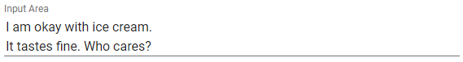

# sentiment-aware-input

An input box that provides feedback to the user about the sentiment of their text

Here are some example screenshots

When the text is negative:


When the text is positive:


When the text is neutral:




## Running

```sh
sbt run
```

## License
Apache 2
